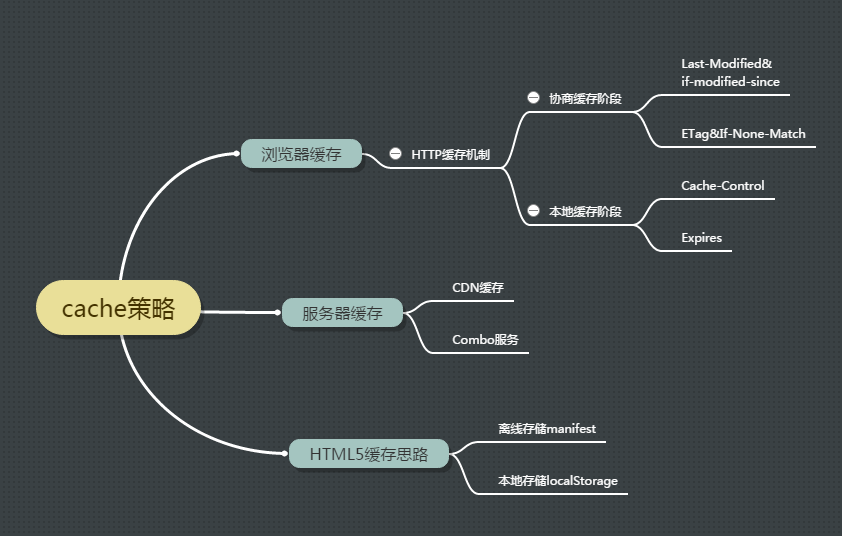
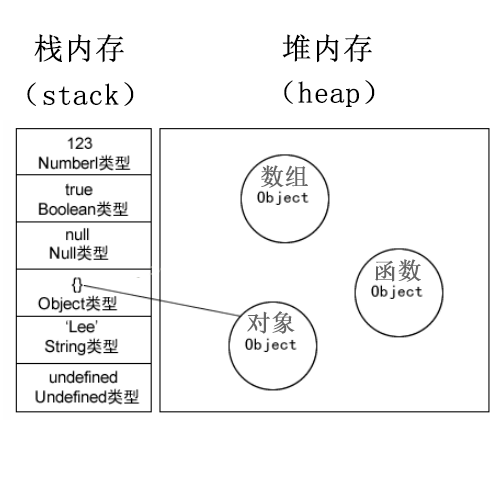

# Vue

## 谈一谈你对Vue的理解

## Vue的响应式数据
解决的问题: Native Javascript无法支持响应式数据
```js
let total = 0 
let product = { price: 5, quantity: 2 }
const effect = () => total = product.price * product.quantity
effect()

console.log(total) // 10 
product.quantity = 3 
console.log(total) // 10 


```
### `trigger` 和 `track`

```js
let depsMap = new Map()
const product = { price: 5, quantity: 2 }
let total = 0

const effect = () => {
  total = product.price * product.quantity
}

const track = (key) => {
  let dep = depsMap.get(key)
  if (!dep) depsMap.set(key, dep = new Set())
  dep.add(effect)
}

const trigger = (key) => {
  let dep = depsMap.get(key)
  if (dep) {
    dep.forEach(eff => eff())
  }
}

track('price')
trigger('price')

console.log(total) // 10

product.price = 10
trigger('price')

console.log(total) // 20  

```

### `targetMap`

弱映射, 将我们想要记录的对象存储到表中的key, 其中的变化存储为value.
> *WeakMap* 对象是一组键/值对的集合, 其中的键是弱引用的, 且必须是对象类型, 值可以是任意的;
> 
> 使用弱映射的好处:*WeakMap* 的键不可枚举，**当键所指的对象没有在其他地方引用时，将会被GC垃圾回收机制回收 => 有效解决内存溢出问题** 
```js
let targetMap = new WeakMap()

const effect = () => total = product.price * product.quantity

const tracker = (target, key) => {
  let depsMap = targetMap.get(target)
  if (!depsMap) targetMap.set(target, depsMap = new Map())

  let dep = depsMap.get(key)
  if (!dep) depsMap.set(key, dep = new Set())

  dep.add(effect)
}

const trigger = (target, key) => {
  let depsMap = targetMap.get(target)
  if (!depsMap) return

  let dep = depsMap.get(key)
  if (!dep) return

  dep.forEach(eff => eff())
}

let total = 0
const product = { price: 5, quantity: 2 }

tracker(product, 'price')
product.price = 6

trigger(product, 'price')
total

product.price = 10
trigger(product, 'price')
total 
```

### Automation with *Reflect* and *Proxy*
> `const proxy = new Proxy(target, handler)` 用来创建对象的代理，从而实现基本的拦截和自定义
> * target: 表示要拦截的对象
> * handler: 在handler中可以放入一个trap来拦截, 如果handler为空, 表示访问被拦截的对象本身

> `Reflect` 用来实现对象方法的意义对应(保证this指向的正确性)

在这个场景中, 我们需要拦截的是对象get和set状态

```js
let targetMap = new WeakMap()

const effect = () => total = product.price * product.quantity

const tracker = (target, key) => {
  let depsMap = targetMap.get(target)
  if (!depsMap) targetMap.set(target, depsMap = new Map())

  let dep = depsMap.get(key)
  if (!dep) depsMap.set(key, dep = new Set())

  dep.add(effect)
}

const trigger = (target, key) => {
  let depsMap = targetMap.get(target)
  if (!depsMap) return

  let dep = depsMap.get(key)
  if (!dep) return

  dep.forEach(eff => eff())
}

const reactive = (target) => {
  const handler = {
    get(target, key, receiver) {
      let result = Reflect.get(target, key, receiver)
      tracker(target, key)
      return result
    },
    set(target, key, value, receiver) {
      let old = target[key]
      let result = Reflect.set(target, key, value, receiver)
      if (old && old !== result) trigger(target, key)
      return result
    }
  }

  return new Proxy(target, handler)
}

let total = 0
let product = reactive({ price: 5, quantity: 2 })

effect()
total
product.price = 8
total 

```

### Vue3 和 Vue2 响应实数据的不同

因为Vue2 用的是getter/setter, 只有在对象拥有某属性的时候通过`Object.defineProperty`来实现订阅, 这就意味着如果我们单纯的对一个对象做添加属性的操作, 响应市就会失效, 这是我们需要使用`vue.$set()`方法来强制Vue2 对某个对象添加新的属性; 而Vue3利用Proxy拦截器的机制, 对于新添加进来的属性也能够实现响应实.

> 我们知道 Vue2 是响应式原理基于 Object.defineProperty 方法重定义对象的 getter 与 setter，vue3 则基于 Proxy 代理对象，拦截对象属性的访问与赋值过程。差异在于，前 者并不能对诸如数组长度变化、增删元素操作、对象新增属性进行感知，在 vue 层面不得不 重写一些数组方法（push、pop、unshift、shift 等），动态添加响应式属性，也要使用 $set 方法等。而 Proxy 则完美地从根上解决了这些问题，不过对于不支持 Proxy 对象的浏览器（如 IE），如果要使用 vue3 依然要进行降级兼容

### `ref` 和 `reactive` 的区别
* ref
  * 用来定义基本数据类型;
  * 必须使用`.value`来获取值
  * 能够直接替换`.value`中的值
* reactive
  * 用来定义复杂数据类型
  * 无法替换值

### `ref`的实现

```js
// native javascript中使用get和set方法来计算属性
let user = {
  firstName: 'Wei',
  lasName: 'Wang',

  get fullname() {
    return `${this.firstName} ${this.lastName}`
  },

  set fullname(value) {
    [this.firstName, this.lastName] = value.split('')
  }
}
```

```js
import { tracker, trigger } from './index'

const ref = (raw) => {
  const r = {
    get value() {
      tracker(r, 'value')
      return raw
    },

    set value(newVal) {
      raw = newVal
      trigger(r, 'value')
    }
  }

  return r
}

```
### effect

虽然现在product为响应式对象，但是当每次给product赋值的时候，track方法都会再被调用一次。而在理想状态下，track方法只有在effect生效的瞬间才需要被调用。所以
```js 
let activeEffect = null

const effect = (eff) => {
  activeEffect = eff
  activeEffect() 
  activeEffect = null 
} 

// 修改tracker触发的条件
export const tracker = (target, key) => {
  if (!activeEffect) return // 获取值的时候不触发, 只在发生改变时触发
  console.log(`enable with ${key}`)
  let depsMap = targetMap.get(target)
  if (!depsMap) targetMap.set(target, depsMap = new Map())

  let dep = depsMap.get(key)
  if (!dep) depsMap.set(key, dep = new Set())

  dep.add(activeEffect)
}
```

### Wrap up
```js
// 最终结果
const salePrice = ref(0)
const total = ref(0)
const product = reactive({ price: 5, quantity: 2 })
effect(() => salePrice.value = product.price * 0.8)
effect(() => total.value = salePrice.value * product.quantity)

console.log(total.value) // 8
```

## **MVVM** 设计模式

### **MVVM** 的组成
> **Model** - **View** - **ViewModel** 
> 
> 最核心的就是 **ViewModel**. 在Vue中, ViewModel包括两部分: *DOM Listeners* 和 *Data Bindings*

* 从 **Model** 到 **View** 的映射 —— *Data Bindings*, 也就是将模型转化为视图的过程.
* 从 **View** 到 **Model** 的事件监听 —— *DOM Listeners*, 也就是将页面转换成后端数据的过程.


### **MVVM** 与 **MVC**
**MVC**: **Model** - **View** - **Controller**. MVC是单向通信, 也就是将Model渲染到View上, 必须通过Controller来承上启下. 而MVVM并不是用 **ViewModel** 来完全替代 **Controller**, 它只是将数据渲染的功能抽离出来, 其他业务还是需要放在 **Controller** 中来实现.

### 使用 **MVVM** 的好处
* 实现数据的双向绑定
* 实现了页面业务逻辑和渲染之间的解耦, 即数据与视图之间的解耦, 方便组件化开发. 

### Vue 如何实现MVVM思想 
* `{{ }}` 胡子语法, 实现了数据和视图的绑定
* `v-on` 事件绑定, 通过事件才做数据时, `v-model`会发生响应变化 

## MVVM 的实现原理(以 *Vue2.x* 为例)
通过 **数据劫持** 加上 **发布订阅模式** 

实现数据劫持: 
* 观察对象, 给对象加上Object.defineProperty() 
* 不能新增不存在的属性, 不存在的属性没有get和set
* 深度响应 

### 带`{{ }}`的模板
```html
<!DOCTYPE html>
<html lang="en">

<head>
  <meta charset="UTF-8">
  <meta http-equiv="X-UA-Compatible" content="IE=edge">
  <meta name="viewport" content="width=device-width, initial-scale=1.0">
  <title>MVVM</title>
</head>

<body>
  <div id="app">
    Hi, I am {{ account.userId }}
  </div>
</body>

</html>
```

### MVVM类模型
```js
export class Vue {
  constructor(options) {
    this.$options = options
    // 模仿vue劫持数据
    let data = this._data = this.$options.data
    let el = this.$el = this.$options.el
    Observe(data)

    // 数据代理, 不需要使用 this._data.property 访问属性, 可直接使用 this.property 
    for (let key in data) {
      Object.defineProperty(this, key, {
        configurable: true,
        get() {
          return this._data[key]
        },
        set(newVal) {
          this._data[key] = newVal
        }
      })
    }
  }
}
```

### 订阅
```js
export function Observe(data) {
  if (!data && typeof data !== 'object') return
  for (let key in data) {
    let val = data[key]
    // 递归设置属性, 实现深度响应
    Observe(val)
    // defineProperty
    Object.defineProperty(data, key, {
      configurable: true,
      get() {
        return val
      },
      set(newVal) {
        if (newVal === val) return
        val = newVal
        Observe(val) // 当设置为新值后，也需要把新值再去定义成属性
      }
    })
  }
}
```

### 数据编译
目的是为了把模板里面的 `{{ }}` 中的值拿出来
```js
/**
 * @param {HTMLDivElement} el 
 * @param {Vue} vm 
 */
class Compiler {
  constructor(el, vm) {
    // 将el挂载到实例上方便调用
    vm.$el = document.querySelector(el)

    // 借助文档碎片移到内存中
    let fragment = document.createDocumentFragment()
    const child = vm.$el.firstChild

    if (child) { // Vue中要求模版放在一个标签中包裹起来
      fragment.appendChild(child) // 将el中的内容放在内存中
    }

    // 替换el里面的内容
    this.replaceElement(fragment, vm)

    vm.$el.appendChild(fragment)
  }

  replaceElement(frag, vm) {
    console.log(frag)
    const childNodes = Array.from(frag.childNodes)
    childNodes.forEach(node => {
      let text = node.textContent
      let reg = /\{\{(.*?)\}\}/g;   // 正则匹配{{}}

      // console.log(text.match(reg))

      if (node.nodeType === 3 && reg.test(text)) { // 即使文本有有胡子括号
        const literals = text.match(reg)
        literals.forEach(literal => {
          const arr = literal.split('.').map(item => {
            item = item.replace(/\{\{/, '')
            item = item.replace(/\}\}/, '')
            return item.trim()
          })
          let val = vm
          val = arr.reduce((prev, curr) => prev[curr], val)
          console.log('should replace', literal)
          console.log('with', val)
          text = text.replace(literal, val)
          console.log(text)
        })
        node.textContent = text
      }

      if (node.childNodes.length) {
        replaceElement(node)
      }
    })
  }
}
```

```js
export class Vue {
  constructor(options) {
    this.$options = options
    // 模仿vue劫持数据
    let data = this._data = this.$options.data
    let el = this.$el = this.$options.el
    Observe(data)

    // 数据代理
    this.exposeProperty(data)

    // 数据编译
    new Compiler(this.$el, this)
  }

  exposeProperty(data) {
    for (let key in data) {
      Object.defineProperty(this, key, {
        configurable: true,
        get() {
          return this._data[key]
        },
        set(newVal) {
          this._data[key] = newVal
        }
      })
    }
  }
}

```

### 发布订阅
```js
export function Dep() {
  this.subs = []
}

Dep.prototype.addSub = function (sub) {
  this.subs.push(sub)
}

Dep.prototype.notify = function () {
  this.subs.forEach(sub => sub.update())
}


export function Watcher(fn) {
  this.fn = fn
}

Watcher.prototype.update = function () {
  this.fn()
}
```

### 数据更新视图(订阅事件)
* 但数据改变时重新刷新视图: `Compiler`, 通过 `new Watcher()` 订阅数据
```js
// 需要修改Compiler逻辑, 在触发replaceText的时候监听订阅
function replaceText(vm, node, text, reg) {
  node.textContent = text.replace(reg, (matched, placeholder) => {
    placeholder = placeholder.trim() 
    // 更新时发布订阅
    new Watcher(vm, placeholder, () => replaceText(vm, node, text, reg))
    return placeholder.split('.').reduce((prev, curr) => prev[curr], vm)
  })
}

class Compiler {
  constructor(el, vm) {
    // 将el挂载到实例上方便调用
    vm.$el = document.querySelector(el)

    // 借助文档碎片移到内存中
    let fragment = document.createDocumentFragment()
    const child = vm.$el.firstChild

    if (child) { // Vue中要求模版放在一个标签中包裹起来
      fragment.appendChild(child) // 将el中的内容放在内存中
    }

    // 替换el里面的内容
    this.replaceElement(fragment, vm)

    vm.$el.appendChild(fragment)
  }

  replaceElement(frag, vm) {
    console.log(frag)
    const childNodes = Array.from(frag.childNodes)
    childNodes.forEach(node => {
      let text = node.textContent
      let reg = /\{\{(.*?)\}\}/g; // 正则匹配{{}}

      if (node.nodeType === 3 && reg.test(text)) { // 即使文本有胡子括号
        replaceText(vm, node, text, reg)
      }

      if (node.childNodes.length) {
        replaceElement(node)
      }
    })
  }
}
```

* 限定改变触发条件
```js
// 修改 Watcher
function Watcher(vm, prop, fn) {
  this.fn = fn
  this.vm = vm
  this.prop = prop

  Dep.target = this
  let arr = prop.split('.')
  let val = vm
  val = arr.reduce((prev, curr) => prev[curr], val) // 触发Object.prototype.get方法
  Dep.target = null
}

Watcher.prototype.update = function () {
  let arr = this.prop.split('.')
  let val = this.vm
  val = arr.reduce((prev, curr) => prev[curr], val)
  this.fn(val)
}
```

* 在观察者中的getter和setter中触发订阅
```js
function Observe(data) {
  if (typeof data !== 'object') return
  let dep = new Dep()
  for (let key in data) {
    let val = data[key]
    // 递归设置属性, 实现深度响应
    Observe(val)
    // defineProperty
    Object.defineProperty(data, key, {
      configurable: true,
      get() {
+       Dep.target && dep.addSub(Dep.target)
+       console.log(Dep.target)
        return val
      },
      set(newVal) {
        if (newVal === val) return
        val = newVal
        Observe(val) // 当设置为新值后，也需要把新值再去定义成属性
+       dep.notify()
      }
    })
  }
}
```

### 双向数据绑定
* 增加节点判断 `node.nodeType === 1` 
* 监听变化 `new Watcher`

```js

```

## Vue中组件更新的过程
组件更新的过程主要有2个阶段：

* 比对(diff的运算过程)
* 修改(diff的返回结果，输出生成的patch并操作)

整个数据更新到页面视图更新的流程就是，vue里mountComponent里创建了Watcher, Watcher的constructor里调用了getter，获取视图层直接关联的数据，从而触发属性的getter方法进行依赖收集(*数据劫持*)。当监听数据的setter调用时触发watcher.update，而updateComponent即是watcher里作为回调的getter函数，从而在updateComponent中调用_update，_update再调用__patch__方法批量派发更新内容(*发布订阅模式*), web端的patch方法对最终的dom节点更新。


## 谈一谈你对Vue指令的理解, 怎么去封装一个Vue的自定义指令
## *Vue 2.0* 和 *Vue 3.0* 的区别; 它们发生了哪些变化
## **Computed计算属性** 和 **Watch监听** 的区别
## *vnode* 是什么? 它是如何渲染的? 
## *Vue* 的生命周期和执行顺序
## *Vuex* 的 **核心属性** 和 **运转机制**(action, mutation, state)
## **keep alive** 这个组件的实现原理
## 如何在 *Vue* 项目中应用权限
## 如何在 *Vue* 中设置 **导航守卫** 

# React

## *for*循环*key*的作用是什么 
## 类组件中 *setState* 第二个参数的作用
## 调用 *setState* 的时候发生了什么
## 为什么要先调用 *render* 再调用 *setState* 
## *ref* 的作用
## 哪个生命周期适合发起ajax请求
## React的事件处理逻辑
## *createElement* 和 *cloneElement* 的区别
## 谈一谈对 *Redux* 的理解
## **函数式组件** 和 **类式组件** 的选择; 它们的本质区别是什么? 
## 描述一下 *HOC* 高阶组件 和 *render props* 
## *React中* **Diff算法** 的分析
## *React16* 生命周期的钩子函数
## 为什么要使用虚拟DOM来提升性能


# JavaScript
## 描述一下 `document.load` 和 `document.ready` 之间的区别
load 是指全部资源加载外层后(dom树, 图片, css, js)等加载完之后才执行
ready: 在DOM树加载完之后就执行
> DOM文档加载的过程
> 解析域名 解析html结构 解析js和css文件 执行脚本 创造DOM模型 ready 加载静态资源 load
## 如何检测一个字符串的类型; 如何检测一个变量是string类型
* typeof(str)
* str.constructor

## `==` 和 `===` 的区别
发生隐式转换, 具体的

## **事件委托** 和 **事件冒泡**

### 事件委托
给每个事件都绑定一个事件需要遍历, 过于消耗性能, 所以给父组件添加事件, 就可以委托其为下面的子组件都加上事件. 当我们触发子组件的事件时候, 子组件就会通过*事件冒泡*的机制去调取父组件的事件回调; 如果子组件有`e.prevetDefault()`, 那么*事件委托*失效.

### 事件冒泡
事件冒泡，就是点击最里面的元素，会触发父元素的方法. 

### 事件流
事件流包含三个阶段：
* 事件捕捉阶段：事件开始由顶层对象触发，然后逐级向下传播，直到目标元素；
* 处于目标阶段：处在绑定事件的元素上；
* 事件冒泡阶段：事件由具体的元素先接收，然后逐级向上传播，直到不具体的元素；


## `new` 操作符做了哪些事情
* 创建一个空对象`{}`
* 这个对象会被执行`__proto__`链接
* 生成的新对象会被绑定到函数调用的`this`
* 通过这个new创造的每一个实例都会被`__proto__`链接到`prototype`
* 如果函数没有返回对象类型`Object`(包含`Functoin`, `Array`, `Date`, `RegExg`, `Error`)，那么`new`表达式中的函数调用会自动返回这个新的对象。
  > 注：如果`new`调用的返回值没有返回对象或者函数，那就返回整个*constructor*函数`{}`内的东西。
  ```js
  function Male(name) {
    this.name = name // 没有返回对象或者函数
  }

  function Female(name) {
    // 返回对象和函数
    return {
      name: name
    }
  }

  const Will = new Male('Will')
  console.log(Will) // Male { name: 'Will'}

  const Akina = new Female('Akina')
  console.log(Akina) // { name: 'Akina' }
  ```
## JS如何实现**继承**, 它的优缺点是什么
前提条件: 提供父类
```js
function Animal(name) {
  // 属性
  this.name = name
  // 实例方法
  this.walk = function() {
    console..log('walk')
  }
}
// 原型方法
Animal.prototype.eat = function() {
  console.log('eat')
}

```

1. 原型链继承
```js
function Cat() {}
Cat.prototype = new Animal()
Cat.prototype.name = 'Eli'
```
2. 利用构造函数
```js
funtion Cat(name) {
  Animal.call(this)
  this.name = name 
}
```
3. 实例继承
```js
function Cat(name) {
  var instance = new Animal() 
  instance.name = name
  return instance 
}

```
4. 组合
调用父类构造函数，继承父类的属性，通过将父类实例作为子类原型，实现函数复用
```js
function Woman(name,age){
  People.call(this,name,age)
}
Woman.prototype = new People();
Woman.prototype.constructor = Woman;
```

5. 寄生组合继承
6. ES6
```js
class Animal{
  construnctor(name) {
    this.name = name
  }

  eat() {}
  walk() {}
}

class Dog extends Animal {
  constructor(name) {
    super(name)
  }
}
```
## 闭包的理解; 如何解决闭包引起的内存泄漏?
### 什么是闭包？
能够访问其他函数内部变量的函数

### 闭包解决了什么问题
由于变量的作用域的原因-----（函数内部能读取全局变量，函数外部无法读取函数内部的变量【局部变量】），为了在函数外部读取局部变量，所以就有了闭包。

### 闭包的作用
1. 访问其他函数内部变量
2. 保护变量不被内存回收机制回收
3. 避免全局变量被污染 方便调用上下文的局部变量 加强封装性

```js
function foo {
  let code = 'secret'
  return showMeCode() {
    console.log(code)
  }
}

foo.showMeCode() // secret

```

### 闭包的缺点, 如何解决
闭包长期占用内存，内存消耗很大，可能导致内存泄露
* 在退出函数之前，将不使用的局部变量全部删除。可以使变量赋值为null
* 避免变量的循环赋值和引用

## 原型和原型链
* 核心：先有Object.prototype（原型链顶端），Function.prototype继承Object.prototype而产生，最后，Function和Object和其它构造函数继承Function.prototype而产生。
* 对于一个对象来说__proto__的属性的值就是它对应的原型对象
* 只有函数才有prototype属性，Object.prototype是原型链的顶端

## 作用域和作用域链
> 每一个作用域都有对其父作用域的引用。当我们使用一个变量的时候，Javascript引擎 会通过变量名在当前作用域查找，若没有查找到，会一直沿着作用域链一直向上查找，直到 global 全局作用域。

> Javascript的词法作用域决定了函数的作用域在其被定义的时候就决定了，这是因为当函数创建的时候，它的内部属性 [[ Scope ]]就会保存父对象到其中。

```
ECStack = [
	EC(G): {
		VO(G): {
			..., //包含全局对象原有的属性
			X: 1, 
			A: function(){/*...*/},
			A[[ scope ]] = this
		}
	},
	EC(A):{
		[scope]:VO(G),  // 因为在VO(G)中，A[[ scope ]] = this, 也就是 A[[ scope ]]: VO(G)
		AO(A):{
			y: 1, // 局部变量
			x: 2, 
			B: function(){ /* ... */ }, // 定义函数B
			B[[ scope ]] = this, // this指代AO(A)本身
			arguments:[], 
			this: window // 因为函数A是在全局环境中被调用的，所以this指向window
		}, 
		/*****************************************************
		*  原来是<A[[scope]]>， 因为AO(A)被推到作用域链的顶端。
		*  所以<AO(A), A[[scope]]> 
		*  又因为A[[scope]] = VO(G), 所以<AO(A), VO(G)>
		*****************************************************/
		scopeChain: <AO(A), A[[ scope ]]>
	},
	EC(B):{
		[scope]:VO(A), // 因为在VO(A), B[[scope]] = this，也就是B[[ scope ]] = VO(A)
		AO(B):{
			z: 1, 
			arguments:[], 
			this:window // 因为函数B是在全局环境中调用的，所以this指向的是window
		}, 
		/*****************************************************
		*  原来是<B[[scope]]>， 因为AO(B)被推到作用域链的顶端。
		*  所以<AO(B), B[[scope]]> 
		*  又因为B[[scope]] = AO(A)， 
		*  所以<AO(B), AO(A)>,因为AO(A)的作用域链为<AO(A), VO(G)>
		*  所以<AO(B), AO(A), VO(G)>
		*****************************************************/
		scopeChain:<AO(B), B[[scope]]>
	},
]
```

## *浏览器缓存*, *服务器缓存* 和 *cdn缓存*

### 用户发起请求(没有CDN)
CDN, 即Content Delivery Network
1. 用户在浏览器访问栏中输入要访问的域名；
2. 浏览器向DNS服务器请求对该域名的解析；
3. DNS服务器返回该域名的IP地址给浏览器
4. 浏览器使用该IP地址向服务器请求内容。
5. 服务器将用户请求的内容返回给浏览器。


### 用户发起请求(有CDN)

1. 用户在浏览器中输入要访问的域名。
2. 浏览器向DNS服务器请求对域名进行解析。由于CDN对域名解析进行了调整，DNS服务器会最终将域名的解析权交给CNAME指向的CDN专用DNS服务器。
3. CDN的DNS服务器将CDN的负载均衡设备IP地址返回给用户
4. 用户向CDN的负载均衡设备发起内容URL访问请求
5. CDN负载均衡设备会为用户选择一台合适的缓存服务器提供服务
6. 用户向缓存服务器发出请求。
7. 缓存服务器响应用户请求，将用户所需内容传送到用户。

### CDN的选择策略
选择的依据包括：根据用户IP地址，判断哪一台服务器距离用户最近；根据用户所请求的URL中携带的内容名称，判断哪一台服务器上有用户所需内容；查询各个服务器的负载情况，判断哪一台服务器的负载较小。

### 缓存策略

没有CDN：浏览器缓存

使用了CDN：浏览器缓存+CDN缓存

在用户第一次访问网站后，网站的一些静态资源如图片等就会被下载到本地，作为缓存，当用户第二次访问该网站的时候，浏览器就会从缓存中加载资源，不用向服务器请求资源，从而提高了网站的访问速度，而若使用了CDN，当浏览器本地缓存的资源过期之后，浏览器不是直接向源站点请求资源，而是向CDN边缘节点请求资源，CDN边缘节点中也存在缓存，若CDN中的缓存也过期，那就由CDN边缘节点向源站点发出回源请求来获取最新资源。

### 浏览器缓存
#### 强缓存

#### 协商缓存


## 如何实现代理? 什么是跨域? 有哪些方式能够实现跨域通信?

### 跨域
如果两个页面之间, 协议、域名、端口号、子域名不同, 那么就会发生跨域, 而浏览器一般为了安全都限制了跨域访问，也就是不允许跨域访问资源。


### 如何解决跨域通信: cookies

Cookie 是服务器写入浏览器的一小段信息，只有同源的网页才能共享。但是，两个网页一级域名相同，只是二级域名不同，浏览器允许通过设置document.domain共享 Cookie。

举例来说，A网页是http://w1.example.com/a.html，B网页是http://w2.example.com/b.html，那么只要设置相同的document.domain，两个网页就可以共享Cookie。

可以在网页中定义domain属性
```js
document.domain = 'example.com'
```
或者在服务器中设置
```nginx
Set-Cookie: key=value; domain=.example.com; path=/
```

### 如何解决跨域通信: window.postMessage
HTML5协议中新引入的api——跨文档通信(Cross-Docuemnt Messageing)
举例来说，父窗口http://aaa.com向子窗口http://bbb.com发消息，调用postMessage方法就可以了。
`window.postMessage(<message>, <to-origin>)`

```js
var popup = window.open('http://bbb.com', 'title');
popup.postMessage('Hello World!', 'http://bbb.com');
```
### 如何解决跨域通信: ajax
同源政策规定，AJAX请求只能发给同源的网址，否则就报错。
除了架设服务器代理（浏览器请求同源服务器，再由后者请求外部服务），有三种方法规避这个限制。

* JSONP
* CORS
* WebSocket

## 描述一下 *jsonp* 的实现原理; *jsonp* 如何实现跨域请求
JSONP是服务器与客户端跨源通信的常用方法。最大特点就是简单适用，老式浏览器全部支持，服务器改造非常小。
它的基本思想是，网页通过添加一个`<script>`元素，向服务器请求JSON数据，这种做法不受同源政策限制；服务器收到请求后，将数据放在一个指定名字的回调函数里传回来。


```js
function addScriptTag(src) {
  var script = document.createElement('script');
  script.setAttribute("type","text/javascript");
  script.src = src;
  document.body.appendChild(script);
}

window.onload = function () {
  addScriptTag('http://example.com/ip?callback=foo');
}

function foo(data) {
  console.log('Your public IP address is: ' + data.ip);
};
```
服务器收到这个请求以后，会将数据放在回调函数的参数位置返回。

```js
foo({
  "ip": "8.8.8.8"
});
```


### 如何解决跨域通信: CORS
CORS与JSONP的使用目的相同，但是比JSONP更强大。

JSONP只支持GET请求，CORS支持所有类型的HTTP请求。JSONP的优势在于支持老式浏览器，以及可以向不支持CORS的网站请求数据。

CORS需要浏览器和服务器同时支持。目前，所有浏览器都支持该功能，IE浏览器不能低于IE10。因此，**实现CORS通信的关键是服务器。只要服务器实现了CORS接口，就可以跨源通**.
### CORS简单请求
    * 请求方法为以下
      * HEAD
      * GET
      * POST
    * HTTP请求不超过以下几种
      * Accept
      * Accept-Language
      * Content-Language
      * Last-Event-ID
      * Content-Type: `application/x-www-form-urlencoded`, `multipart/form-data`, `text/plain`
对于简单请求，浏览器直接发出CORS请求。具体来说，就是在头信息之中，增加一个Origin字段。
```
GET /cors HTTP/1.1
Origin: http://api.bob.com 
Host: api.alice.com
Accept-Language: en-US
Connection: keep-alive
User-Agent: Mozilla/5.0...
```
Origin表示本次请求来自哪个源（协议 + 域名 + 端口）。服务器根据这个值，决定是否同意这次请求。

__不同意的情况__

如果Origin指定的源，不在许可范围内，服务器会返回一个正常的HTTP回应。浏览器发现，这个回应的头信息没有包含Access-Control-Allow-Origin字段（详见下文），就知道出错了，从而抛出一个错误，被XMLHttpRequest的onerror回调函数捕获。注意，这种错误无法通过状态码识别，因为HTTP回应的状态码有可能是200。

__同意的情况__

如果Origin指定的域名在许可范围内，服务器返回的响应，会多出几个头信息字段。
```
Access-Control-Allow-Origin: http://api.bob.com
Access-Control-Allow-Credentials: true
Access-Control-Expose-Headers: FooBar
Content-Type: text/html; charset=utf-8
```

* `Access-Control-Allow-Origin`: 必须值, `*`表示允许任意域名的访问
* `Access-Control-Allow-Credentials`: 该字段可选。它的值是一个布尔值，表示是否允许发送Cookie; 如果配置为`true`, 这需要在ajax请求中也打开withCredentials属性。
* `Access-Control-Expose-Headers`: 默认情况下, `XMLHttpRequest.prototype.getResponseHeader`只能拿到6个字段, `Cache-Control`, `Content-Language`, `Content-Type`, `Expires`, `Last-Modified`, `Pragma`. 如果需要添加, 就在这个字段中添加.

### CORS非简单请求
非简单请求是那种对服务器有特殊要求的请求，比如请求方法是PUT或DELETE，或者`Content-Type`字段的类型是`application/json`。

非简单请求的CORS请求，会在正式通信之前，增加一次HTTP查询请求，称为"预检"请求（preflight）。

浏览器先询问服务器，当前网页所在的域名是否在服务器的许可名单之中，以及可以使用哪些HTTP动词和头信息字段。只有得到肯定答复，浏览器才会发出正式的XMLHttpRequest请求，否则就报错。

"预检"请求用的请求方法是OPTIONS，表示这个请求是用来询问的。头信息里面，关键字段是Origin，表示请求来自哪个源。
除了Origin字段，"预检"请求的头信息包括两个特殊字段。

* Access-Control-Request-Method
* Access-Control-Request-Headers

服务器在接受完"预检“请求之后, 确认允许跨源请求，就可以做出回应。

__同意__

和简单请求一样, 如果服务器同意了“预检”请求, 那么便会带上`Access-Control-Allow-Origin`, `Access-Control-Allow-Methods`, `Access-Control-Allow-Headers`, 以及`Access-Control-Allow-Credentials`和`Access-Control-Max-Age`

__不同意__

如果服务器否定了"预检"请求，会返回一个正常的HTTP回应，但是没有任何CORS相关的头信息字段。这时，浏览器就会认定，服务器不同意预检请求，因此触发一个错误，被XMLHttpRequest对象的onerror回调函数捕获。控制台会打印出如下的报错信息。
```
XMLHttpRequest cannot load http://api.alice.com.
Origin http://api.bob.com is not allowed by Access-Control-Allow-Origin.
```


### 如何解决跨域通信: Websocket
WebSocket是一种通信协议，使用ws://（非加密）和wss://（加密）作为协议前缀。该协议不实行同源政策，只要服务器支持，就可以通过它进行跨源通信。
```
GET /chat HTTP/1.1
Host: server.example.com
Upgrade: websocket
Connection: Upgrade
Sec-WebSocket-Key: x3JJHMbDL1EzLkh9GBhXDw==
Sec-WebSocket-Protocol: chat, superchat
Sec-WebSocket-Version: 13
Origin: http://example.com
```
上面代码中，有一个字段是Origin，表示该请求的请求源（origin），即发自哪个域名。

正是因为有了Origin这个字段，所以WebSocket才没有实行同源政策。因为服务器可以根据这个字段，判断是否许可本次通信。如果该域名在白名单内，服务器就会做出如下回应。

```js
var ws = new WebSocket("wss://echo.websocket.org");

ws.onopen = function(evt) { 
  console.log("Connection open ..."); 
  ws.send("Hello WebSockets!");
};

ws.onmessage = function(evt) {
  console.log( "Received Message: " + evt.data);
  ws.close();
};

ws.onclose = function(evt) {
  console.log("Connection closed.");
};  
```

### WebSocket 常用API
* WebSocket.onpen: 连接成功后回调, 如果要使用多个回调, 使用webSocket.addEventListener('open',() => {})
* websocket.onclose
* websocket.onmessage
  ```js
  const socket = new WebSocket('ws://localhost:5500')

  socket.onmessage = (event) => {
    if(typeof event.data === 'String' ) {

    } 
    else if ( event.data instanceof 'ArrayBuffer' ) {

    }
  } 
  ```
  > 可通过`webSocket.binaryType`显式制定收到的二进制类型
* websocket.send: 向服务器发送数据
* webSocket.bufferedAmount 
  ```js
  var data = new ArrayBuffer(10000000);
  socket.send(data);

  if (socket.bufferedAmount === 0) {
    // 发送完毕
  } else {
    // 发送还没结束
  }
  ```
* websocket.onerror


## JS中的 *严格模式*, *正常模式* 和 *松散模式*

## 数据模式: **堆**, **栈** 和 **队列**

### 栈
**遵循 后进先出(LIFO)**

新添加和待删除的数据都保存在栈的同一端栈顶，另一端就是栈底。新元素靠近栈顶，旧元素靠近栈底。 栈由编译器自动分配释放。栈使用一级缓存。调用时处于存储空间，调用完毕自动释放。

在JavaScript, 原始数据类型都存储在栈内存中, 大小都是固定的, 包括 string, number, boolean, integer, 
undefined, null, symbol, bigint 这些

### JavaScript执行栈
* JavaScript在运行的时候会首先创建一个全局对象
  ```js
  var globalContext = {
    Math:{},
    String:{},
    Date:{},
    document:{},//DOM操作
    ...
    window:this//让window属性指向了自身
  }
  ```
* 构建执行环境栈ECS: JS引擎需要构建一个执行环境栈( Execution Context Stack) ，与此同时，也要创建一个全局执行环境（Execution Context）EC ，并将这个全局执行环境EC压入执行环境栈中。
* VO中不仅包含了全局对象的原有属性，还包括在全局定义的变量x 和函数 A，与此同时，在定义函数A的时候，还为 A 添加了一个内部属性scope，并将scope指向了VO。
  ```js
  ECStack = [``````
    EC(G): {
      VO(G): {
        ..., //包含全局对象原有的属性
        X: 1, 
        A: function(){/*...*/},
        A[[ scope ]] = this // 指向VO(G)本身
        this: window
      }
    }
  ]
  ```
* 执行函数A
  * **Execution Context**: JS创建函数A的执行环境EC(A)，然后将EC(A)放到执行环境栈的顶部
  * **Execution Context Stack**: 此时A的执行环境在栈的顶部，全局执行环境在栈的底部
  * **Activaiton Object**: 创建函数A的活动对象(Activation Object)，其中包含了参数，this对象，局部变量和内部函数的定义。AO也会被推到作用域链的顶端
    ```js
    ECStack = [
      EC(G): {
        VO(G): {
          ..., //包含全局对象原有的属性
          X: 1, 
          A: function(){/*...*/},
          A[[ scope ]] = this
        }
      }, 
      EC(A):{
        [scope]:VO(G),  // 函数的作用域
        AO(A):{
          y: 1, // 局部变量
          x: 2, 
          B: function(){ /* ... */ }, // 定义函数B
          B[[ scope ]] = this, // this指代AO(A)本身
          arguments:[], 
          this: window // 因为函数A是在全局环境中被调用的，所以this指向window
        }, 
        /*****************************************************
        *  原来是<A[[scope]]>， 因为AO(A)被推到作用域链的顶端。
        *  所以<AO(A), A[[scope]]> 
        *  又因为A[[scope]] = VO(G), 所以<AO(A), VO(G)>
        *****************************************************/
        scopeChain: <AO(A), VO(G)>
      }
    ]
    ``` 
* 执行函数B
  * **Execution Context**: JS创建函数A的执行环境
  * **Execution Context Stack**: 此时B的执行环境在栈的顶部, A的执行环境和全局执行环境在栈的底部
  * **Activation Object**: 创建函数B的活动对象(Activation Object), 
    ```js
    ECStack = [
      EC(G): {
        VO(G): {
          ..., //包含全局对象原有的属性
          X: 1, 
          A: function(){/*...*/},
          A[[ scope ]] = this
        }
      },
      EC(A):{
        [scope]:VO(G),  // 因为在VO(G)中，A[[ scope ]] = this, 也就是 A[[ scope ]]: VO(G)
        AO(A):{
          y: 1, // 局部变量
          x: 2, 
          B: function(){ /* ... */ }, // 定义函数B
          B[[ scope ]] = this, // this指代AO(A)本身
          arguments:[], 
          this: window // 因为函数A是在全局环境中被调用的，所以this指向window
        }, 
        /*****************************************************
        *  原来是<A[[scope]]>， 因为AO(A)被推到作用域链的顶端。
        *  所以<AO(A), A[[scope]]> 
        *  又因为A[[scope]] = VO(G), 所以<AO(A), VO(G)>
        *****************************************************/
        scopeChain: <AO(A), A[[ scope ]]>
      },
      EC(B):{
        [scope]:VO(A), // 因为在VO(A), B[[scope]] = this，也就是B[[ scope ]] = VO(A)
        AO(B):{
          z: 1, 
          arguments:[], 
          this:window // 因为函数B是在全局环境中调用的，所以this指向的是window
        }, 
        /*****************************************************
        *  原来是<B[[scope]]>， 因为AO(B)被推到作用域链的顶端。
        *  所以<AO(B), B[[scope]]> 
        *  又因为B[[scope]] = AO(A)， 
        *  所以<AO(B), AO(A)>,因为AO(A)的作用域链为<AO(A), VO(G)>
        *  所以<AO(B), AO(A), VO(G)>
        *****************************************************/
        scopeChain:<AO(B), B[[scope]]>
      },
    ]
    ```


### 堆
堆，一般由操作人员（程序员）分配释放，若操作人员不分配释放，将由OS回收释放。分配方式类似链表。堆存储在二级缓存中。
JS中的引用值 Object, Function, Array, Date, RegExp 等都是存储在 堆 内存中. 

### 为什么会有 堆内存和栈内存 之分
通常与垃圾回收机制有关。为了使程序运行时占用的内存最小。

当一个方法执行时，每个方法都会建立自己的内存栈，在这个方法内定义的变量将会逐个放入这块栈内存里，随着方法的执行结束，这个方法的内存栈也将自然销毁了。因此，所有在方法中定义的变量都是放在栈内存中的；

当我们在程序中创建一个对象时，这个对象将被保存到运行时数据区中，以便反复利用（因为对象的创建成本通常较大），这个运行时数据区就是堆内存。堆内存中的对象不会随方法的结束而销毁，即使方法结束后，这个对象还可能被另一个引用变量所引用（方法的参数传递时很常见），则这个对象依然不会被销毁，只有当一个对象没有任何引用变量引用它时，系统的垃圾回收机制才会在核实的时候回收它。

## 原始类型和引用类型

### 原始类型
* string
* number
* int
* bigInt
* boolean
* null
* undefined

对于基本数据类型，如果进行复制，系统会自动为新的变量在栈内存中分配一个新值. 


### 引用类型
* Array
* Object
* Function
* Date
* Regex

引用类型都是存储在 堆 内存中的, 系统也会自动为新的变量在栈内存中分配一个值，但这个值仅仅是一个地址。也就是说，复制出来的变量和原有的变量具有相同的地址值，指向堆内存中的同一个对象。

### 为什么基础数据类型存在栈中，而引用数据类型存在堆中呢？



1. 堆比栈大，栈比对速度快。
2. 基础数据类型比较稳定，而且相对来说占用的内存小。
3. 引用数据类型大小是动态的，而且是无限的。
4. 堆内存是无序存储，可以根据引用直接获取。

## 深拷贝 VS 浅拷贝

赋值操作均是前拷贝, 但是对复制的变量上做改动时, 会影响原来的值.

### 实现浅拷贝的几种方式

* 利用`=`赋值
* 利用`Object.prototype.assign()`
* 利用`Array.prototype.concat()`, `Array.from()`和`Array.prototype.slice()`

### 实现深拷贝的几种方式
* `JSON.parse()` 和 `JSON.stringify()`
    ```js
        const x = {
            a: 1, 
            b: {
                m: 2, 
                n: 3,
            }
        } 
        const y = JSON.parse(JSON.stringify(x))
    ```
* 递归
    ```js
    const x = {
      a: 1,
      b: {
        m: 2,
        n: 3
      },
            c:[1,3,5,7,9]
      foo: function () {
        console.log(this.a)
      },
      bar: Symbol('bar')
    }

    function myDeepCopy(obj) {
      let copy = {} // 创造空对象

      let keys = Object.keys(obj)
      let propKey
      let propVal
      keys.forEach(key => {
        propKey = key
        propVal = obj[key]
        if (typeof propVal === 'object') {
                            // 如果为对象，则递归进入下一层
          copy[propKey] = myDeepCopy(propVal)
        } else {
                            // 否则直接赋值
                            // 此时函数
          copy[propKey] = propVal
        }
      })
      return copy
    }

    let y = myDeepCopy(x)
    console.log(y)
    ```

### 实现深度比较

```TypeScript
export const isEqual = <T>(firstObj: T, secondObj: T): boolean => {
  // 1. 如果不是复杂类型，直接判断
  if (!isReference(firstObj) || !isReference(secondObj)) return firstObj === secondObj

  // 2. 比较是否引用同一个内存地址
  if (firstObj === secondObj) return true

  // 3. 如果都是对象或者数组的话开始深度比较
  const firstKeys = Object.keys(firstObj)
  const secondKeys = Object.keys(secondObj)
  // 3.1 如果长度不相等 
  if (firstKeys.length !== secondKeys.length) return false
  // 3.2 递归判断 
  for (let key in firstObj) {
    const result = isEqual(firstObj[key], secondObj[key])
    if (!result) return false
  }
  return true
}

/* 判断某个值是否是复杂类型 */
export const isReference = <T>(value: T): boolean => {
  return value && typeof value === 'object'
}

```


## 移动端中 `click`, `touch` 和 `tap` 的区别 


